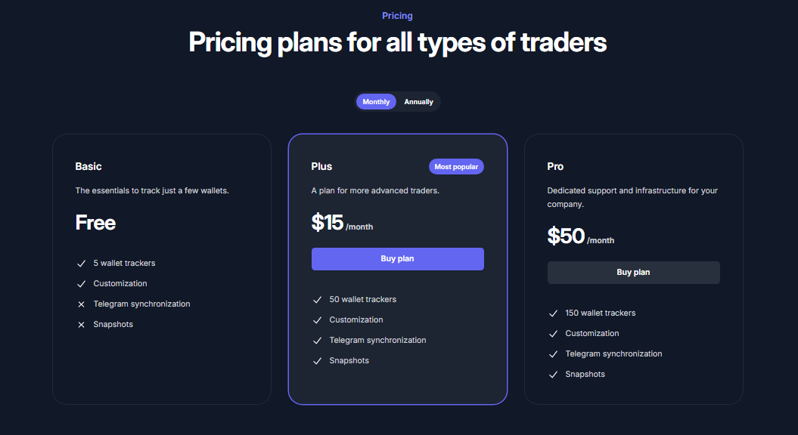

# Setting up the bot


**Good to know:** Solmate is free, and will be so forever. We offer premium plans to support the developer(s) and fund hosting. We mostly rely on donations.


## Invite Solmate

You can invite Solmate by clicking [here](https://discord.com/oauth2/authorize?client\_id=840608489461514340\&scope=bot%20applications.commands).&#x20;

1. Click the link above
2. Make sure you're logged in with Discord. You should see the below
3. 
4. Select the server you want to invite the bot to and click "Authorize"


**Permissions:** We require some permissions to make the bot work, they're all not needed. Permissions, like Manage Roles, are needed to assign holder roles and ticker roles.


## Setting up the features!

Click the links below to set up features.

### Holder roles


[panel.md](../commands/panel.md)


### Price in voice channel


[counter.md](../commands/counter.md)


### Wallet tracker


[address.md](../commands/address.md)


### Listing and sales updates


[getupdates.md](../commands/getupdates.md)

